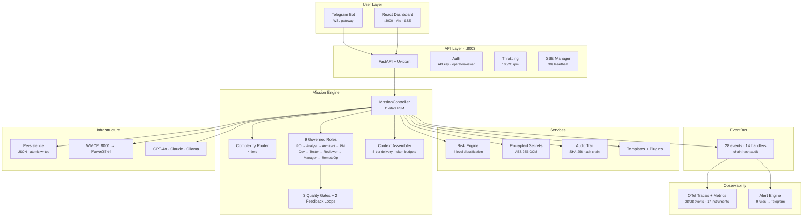

# Vezir

[](https://github.com/ahmetcagriakca/vezir/actions/workflows/ci.yml)
[]()
[]()
[]()

Governed multi-agent mission platform for Windows. Natural language goals become structured, auditable missions executed by 9 specialist AI roles with quality gates, risk classification, and encrypted audit trails.

**3 LLM providers** (GPT-4o, Claude, Ollama) | **24 MCP tools** via PowerShell | **11-state mission FSM** | **React dashboard** with SSE live updates

## Architecture



## Key Features

| Category | What |
|----------|------|
| **Mission Orchestration** | 9 specialist roles, 11-state FSM, 4-tier complexity routing, 3 quality gates |
| **Security** | 4-level risk classification, AES-256-GCM secret store, SHA-256 audit chain, filesystem confinement, API key auth |
| **Observability** | OpenTelemetry traces (28/28), 17 metrics, structured JSON logs, 9 alert rules with Telegram notification |
| **API** | ~35 REST endpoints, SSE live updates, per-endpoint throttling, idempotency keys, OpenAPI schema |
| **Dashboard** | React + Vite + Tailwind, mission timeline, approval inbox, health monitoring, SSE connection indicator |
| **Automation** | 7 GitHub Actions workflows, plan.yaml → issues, PR validator, status sync, evidence collection |
| **Extensibility** | Plugin system (D-118), mission templates (D-119), webhook integration, multi-provider LLM abstraction |

## Quick Start

### Prerequisites

- Windows 11 with WSL2 (Ubuntu)
- Python 3.14+ on Windows
- Node.js 20+ (for dashboard)
- `OPENAI_API_KEY` environment variable (optional: `ANTHROPIC_API_KEY` for Claude)

### Run

```powershell
# Install backend dependencies
pip install -r agent/requirements.txt

# Start WMCP server (required for tool execution)
pwsh -NoProfile -ExecutionPolicy Bypass -File bin\start-wmcp-server.ps1

# Start API server (:8003)
bash scripts/dev-backend.sh

# Start dashboard (:3000)
bash scripts/dev-frontend.sh
```

### Agent Usage

```powershell
# Single-agent mode — direct tool execution
python agent/oc-agent-runner.py -m "CPU ve RAM kullanimi ne?"

# Mission mode — governed multi-role orchestration
python agent/oc-agent-runner.py --mission -m "dashboard'a CPU grafik ekle"
```

### Test

```bash
# Backend (521 tests)
cd agent && python -m pytest tests/ -v

# Frontend (75 tests)
cd frontend && npx vitest run

# Type check
cd frontend && npx tsc --noEmit
```

## Project Structure

```
agent/                  Python backend
  mission/                Mission controller, roles, gates, FSM, router
  api/                    FastAPI endpoints, SSE, schemas
  events/                 EventBus + governance handlers
  observability/          OTel traces, metrics, alerts
  services/               Risk engine, approval, secrets, audit, tools
  providers/              LLM abstraction (GPT-4o, Claude, Ollama)
  persistence/            JSON file stores
  context/                Context assembler, working set, telemetry
  auth/                   API key auth + session
  tests/                  521 pytest tests
frontend/               React dashboard (Vite + Tailwind)
bridge/                 PowerShell bridge to Windows
bin/                    Runtime scripts (WMCP, watchdog, health)
config/                 Environment templates, capabilities manifest
decisions/              Formal decision records (D-105+)
docs/
  ai/                     Living state: STATE, NEXT, DECISIONS, GOVERNANCE, BACKLOG
  architecture/           Architecture overview (HTML interactive)
  archive/                Historical sprint data
.github/workflows/      9 CI/CD workflows
```

## Ports

| Port | Service |
|------|---------|
| 3000 | React Dashboard |
| 8003 | Vezir API (FastAPI) |
| 8001 | WMCP (Windows MCP Proxy) |

## Governance

The project follows a sprint-based governance model with 129 frozen architectural decisions, formal quality gates, and GPT-assisted cross-review. Every sprint produces auditable evidence packets.

See [`docs/ai/GOVERNANCE.md`](docs/ai/GOVERNANCE.md) for sprint rules and [`docs/ai/DECISIONS.md`](docs/ai/DECISIONS.md) for the full decision log.

## Documentation

| Doc | Purpose |
|-----|---------|
| [`docs/ai/STATE.md`](docs/ai/STATE.md) | Canonical system state |
| [`docs/ai/DECISIONS.md`](docs/ai/DECISIONS.md) | 129 frozen decisions (D-001 → D-130) |
| [`docs/ai/GOVERNANCE.md`](docs/ai/GOVERNANCE.md) | Sprint governance rules |
| [`docs/ai/BACKLOG.md`](docs/ai/BACKLOG.md) | Open backlog (33 items) |
| [`docs/ai/NEXT.md`](docs/ai/NEXT.md) | Roadmap + carry-forward |
| [`docs/architecture/`](docs/architecture/) | Architecture overview (interactive HTML) |

## License

Private repository. All rights reserved.
